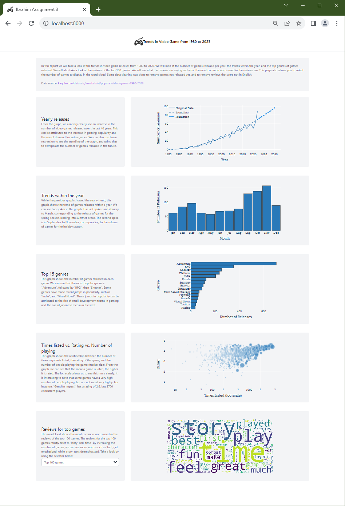

## DATA - 200 | Assignment 3 | Video Game Trends
#### Ibrahim Mansoor Khalid

The goal of this assignment was to create 5 unique charts and display them on a page using django. 
Similar to the [previous](https://github.com/ibrahimmkhalid/data-200-assignment-2) assignment, but 
now has 5 graphs, one of which is interactive.

Dataset source: https://www.kaggle.com/datasets/arnabchaki/popular-video-games-1980-2023

Technologies/Libraries used:
- Django: Used for hosting actual webpage
- Jupyter Notebook: Used to explore dataset in a sandbox
- Pandas: Used to import and prepare the data
- SciKit-Learn: Used to generate polynomial regression
- Plotly: Used to generate actual charts and return them to page
- WordCloud: Used to generate the wordcloud image
- HTMX: Used to perform basic data fetching and replacing
- TailWindCSS: Used to perform basic styling on page

Using the assignment as a basis, I explored some other technologies I was interested in, HTMX and 
TailWindCSS. The 'core' application is configured with 3 urls. The first url displays the index 
page, while the second 'api' url returns the HTML required to display a graph. The index page expects 
some context from Django, this context is a list of graphs. Each of these graphs contains the title, 
text, and id of that graph. The id is required to get the correct graph from the api url. The third 
url is designed specifically for the wordcloud generation as that was designed to be interactive.

TailWindCSS was the primary method for page styling as it allows extensive expression without requiring 
heavy styling libraries or external files. All styles can be displayed inline with the actual HTML element. 
TailWindCSS also allowed the page to have responsive design to work on a wide variety of screen resolutions. 
Some extra styles were defined in './core/static/core/styles.css' to better handle HTMX 
indicators. This was needed to create a better user experience while the user waits for the server to 
respond with the updated wordcloud.

When the page fully loads, the HTMX "load" event is triggered, this sends a GET request to the backend 
using the api url and wordcloud url. The response from these api calls is actually just an HTML string, 
which replaces the DOM element indicated. This is because of the HTMX swap parameter. There is also 
the additional delay modifier in the swap parameter. This delay is required to make sure that the swap 
visually occurs only after all the required JavaScript has finished running. This ensures that the page 
layout does not drastically change into an undesirable state.

Notable files:
- ./games.csv: original datasource
- ./requirements.txt: python packages required for running application
- ./init.py: perform data cleaning on games.csv
- ./scrath.ipynb: exploring dataset in a sandbox
- ./print-layout.pdf: How application looks like when printed
- ./zoomed-out-layout.png: How full application looks like when viewed in webpage
- ./core/data/scrubbed.csv: cleaned datasource
- ./core/templates/index.html: webpage template layout
- ./core/backend.py: where all graphs objects are defined for the webpage
- ./core/views.py: where the graph's auxilliary data is defined
